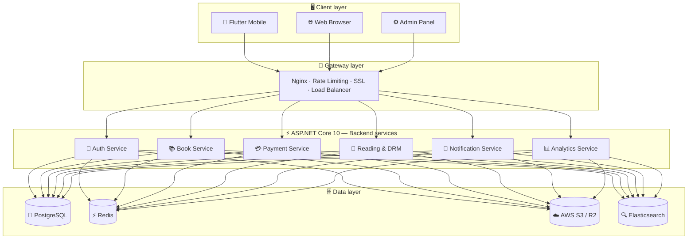
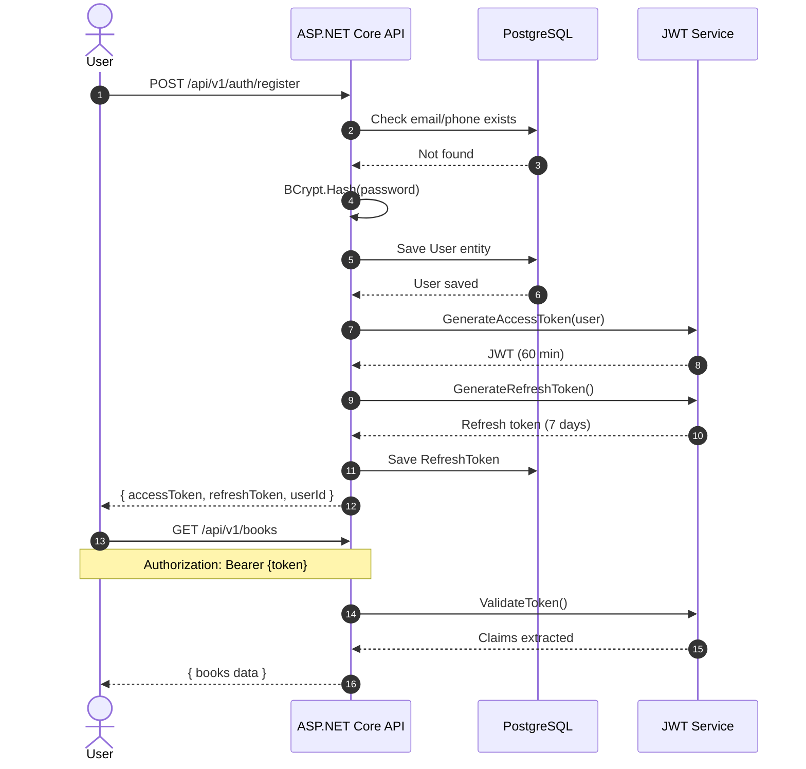
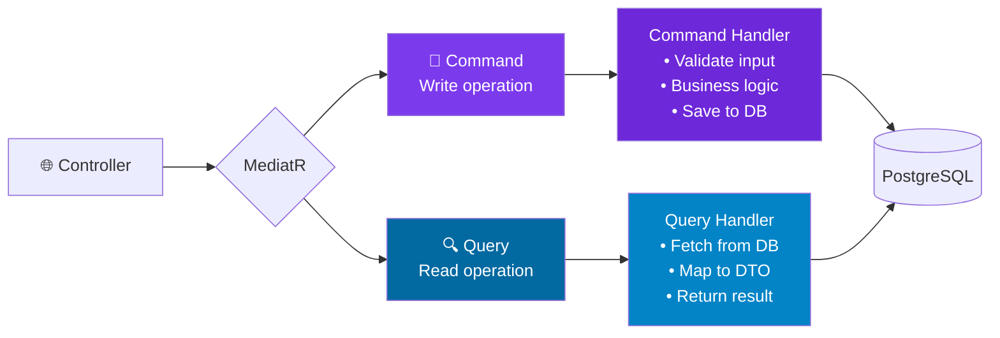
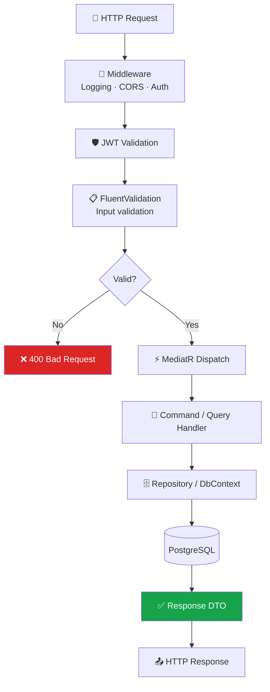
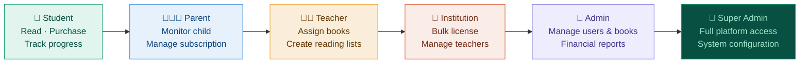
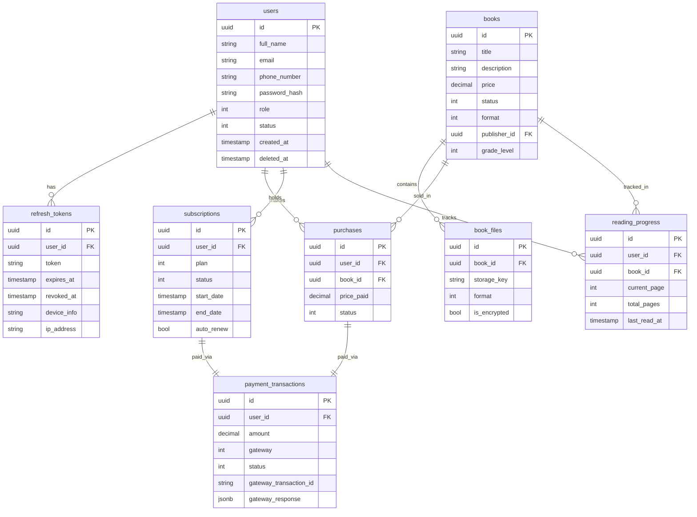
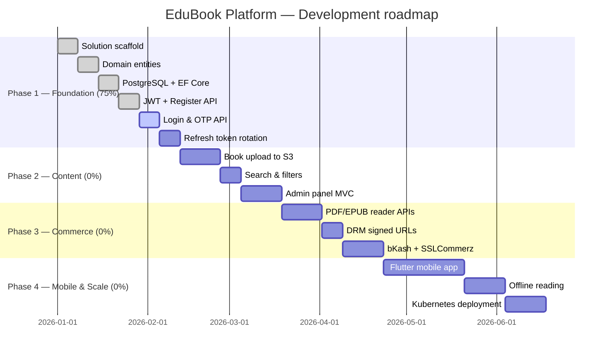
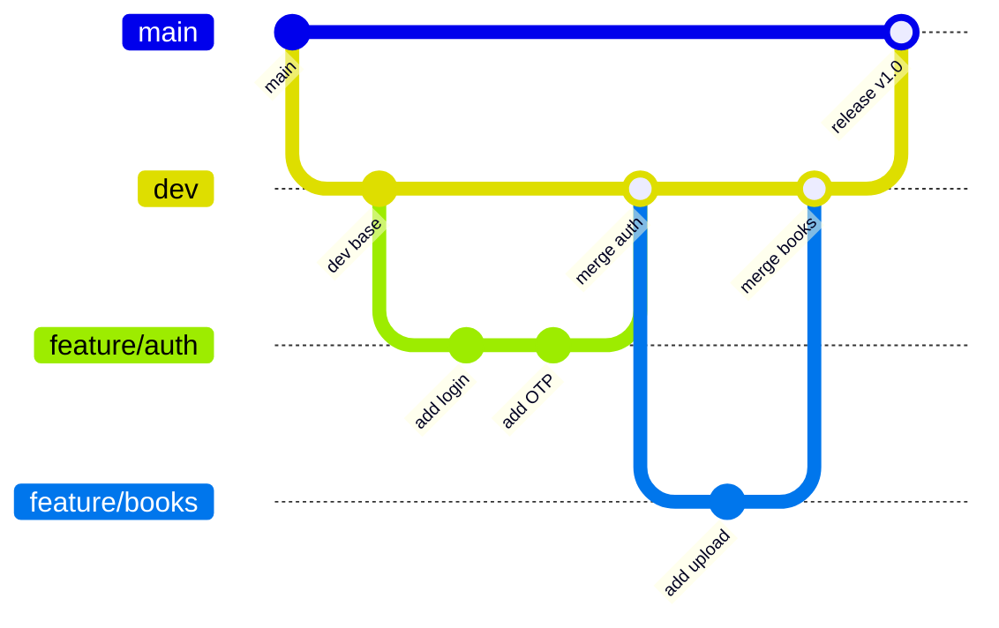

<div align="center">


<br/>

**Kindle × Google Books × LMS — Built for South Asia**

*A production-grade educational eBook platform with DRM protection, local payments, and offline reading.*

<br/>


<br/>


</div>

---

## ✨ Platform features

| 👤 Identity | 📚 Library | 💳 Commerce | 📖 Reading | 🔔 Engagement |
|:---:|:---:|:---:|:---:|:---:|
| JWT Auth | PDF Reader | One-time Purchase | Progress Sync | Push Notifications |
| OTP Verification | EPUB Reader | Monthly Subscription | Bookmarks | SignalR Real-time |
| RBAC (6 roles) | Offline Reading | bKash Integration | Highlights & Notes | Email Alerts |
| Refresh Tokens | Book Search | SSLCommerz | DRM Protection | Promo Campaigns |
| Device Management | Advanced Filters | Coupon System | Signed URLs | Subscription Reminders |

---

## 🏗️ System architecture



---

## 🧅 Clean architecture


---

## 🔐 Authentication flow



---

## ⚡ CQRS pattern



---

## 🔄 Request pipeline



---

## 👥 User roles



| Role | Access level | Key permissions |
|:---|:---:|:---|
| 👤 Student | 20% | Browse, purchase, read, bookmark, track progress |
| 👨‍👩‍👦 Parent | 28% | All student perms + monitor child + manage child subscription |
| 👨‍🏫 Teacher | 38% | All parent perms + assign books + create reading lists |
| 🏫 Institution | 58% | All teacher perms + bulk license + upload books + org reports |
| 🔧 Admin | 80% | All institution perms + manage all users + financial management |
| 👑 Super Admin | 100% | Full access + system config + audit logs + ban/restore users |

---

## 🗄️ Database schema



---

## 🌐 API endpoints

### Authentication
| Method | Endpoint | Description | Auth |
|:---|:---|:---|:---:|
| POST | `/api/v1/auth/register` | Register new user | No |
| POST | `/api/v1/auth/login` | Login user | No |
| POST | `/api/v1/auth/refresh` | Refresh access token | No |
| POST | `/api/v1/auth/logout` | Logout user | Yes |
| POST | `/api/v1/auth/verify-otp` | Verify OTP code | No |

### Books
| Method | Endpoint | Description | Auth |
|:---|:---|:---|:---:|
| GET | `/api/v1/books` | Get all books | No |
| GET | `/api/v1/books/{id}` | Get book detail | No |
| POST | `/api/v1/books` | Upload book | Admin |
| PUT | `/api/v1/books/{id}` | Update book metadata | Admin |
| DELETE | `/api/v1/books/{id}` | Delete book | Admin |

### Reading
| Method | Endpoint | Description | Auth |
|:---|:---|:---|:---:|
| GET | `/api/v1/reading/{bookId}/url` | Get signed read URL | Yes |
| POST | `/api/v1/reading/{bookId}/progress` | Sync reading progress | Yes |
| GET | `/api/v1/reading/{bookId}/progress` | Get reading progress | Yes |
| POST | `/api/v1/reading/{bookId}/bookmarks` | Add bookmark | Yes |
| POST | `/api/v1/reading/{bookId}/highlights` | Add highlight | Yes |

### Commerce
| Method | Endpoint | Description | Auth |
|:---|:---|:---|:---:|
| POST | `/api/v1/purchases` | Purchase a book | Yes |
| GET | `/api/v1/purchases` | Get purchase history | Yes |
| POST | `/api/v1/subscriptions` | Create subscription | Yes |
| GET | `/api/v1/subscriptions` | Get active subscription | Yes |

---

## 🛠️ Technology stack

<details>
<summary><b>View full stack details</b></summary>

<br/>

**Backend**
| Technology | Version | Purpose |
|:---|:---:|:---|
| ASP.NET Core | 10.0 | Web API framework |
| MediatR | Latest | CQRS dispatcher |
| Entity Framework Core | Latest | ORM |
| FluentValidation | Latest | Input validation |
| BCrypt.Net | Latest | Password hashing |
| Serilog | Latest | Structured logging |
| SignalR | Built-in | Real-time communication |
| Swashbuckle | Latest | Swagger / OpenAPI |

**Mobile**
| Technology | Version | Purpose |
|:---|:---:|:---|
| Flutter | 3.x | Cross-platform mobile |
| Riverpod | Latest | State management |
| Dio | Latest | HTTP client |
| Go Router | Latest | Navigation |

**Database & cache**
| Technology | Version | Purpose |
|:---|:---:|:---|
| PostgreSQL | 16 | Primary datastore |
| Redis | 7 | Cache & sessions |
| Elasticsearch | 8.x | Full-text search (Phase 2) |

**Security**
| Technology | Purpose |
|:---|:---|
| JWT Bearer | Access token authentication |
| BCrypt | Password hashing (cost 12) |
| Signed URLs | DRM file access control |
| RBAC | Role-based access control |
| Refresh tokens | Secure session rotation |

**Infrastructure**
| Technology | Purpose |
|:---|:---|
| Docker | Containerization |
| GitHub Actions | CI/CD pipeline |
| AWS S3 / Cloudflare R2 | Book file storage |
| Nginx | Reverse proxy & load balancer |
| Kubernetes | Orchestration (Phase 2) |

</details>

---

## 📁 Project structure

<details>
<summary><b>View solution structure</b></summary>

```
edubook-platform/
│
├── 📁 backend/
│   ├── 📁 EduBook.API/                    ← Entry point
│   │   ├── Controllers/V1/
│   │   │   └── AuthController.cs
│   │   ├── Middleware/
│   │   ├── Extensions/
│   │   ├── Filters/
│   │   └── Program.cs
│   │
│   ├── 📁 EduBook.Application/            ← Use cases
│   │   ├── Common/
│   │   │   └── JwtSettings.cs
│   │   ├── Features/
│   │   │   ├── Auth/
│   │   │   │   ├── Commands/
│   │   │   │   │   ├── RegisterCommand.cs
│   │   │   │   │   └── RegisterCommandHandler.cs
│   │   │   │   ├── Queries/
│   │   │   │   └── DTOs/
│   │   │   ├── Books/Commands & Queries
│   │   │   ├── Reading/Commands & Queries
│   │   │   └── Purchases/Commands & Queries
│   │   ├── Interfaces/
│   │   │   ├── IApplicationDbContext.cs
│   │   │   ├── IJwtService.cs
│   │   │   └── IPasswordHasher.cs
│   │   └── Behaviors/
│   │
│   ├── 📁 EduBook.Domain/                 ← Business core
│   │   ├── Common/
│   │   │   └── BaseEntity.cs
│   │   ├── Entities/
│   │   │   ├── User.cs
│   │   │   ├── RefreshToken.cs
│   │   │   └── OtpCode.cs
│   │   ├── Enums/
│   │   │   ├── UserRole.cs
│   │   │   ├── UserStatus.cs
│   │   │   └── OtpType.cs
│   │   └── Events/
│   │
│   └── 📁 EduBook.Infrastructure/         ← Technical details
│       ├── Persistence/
│       │   └── AppDbContext.cs
│       ├── Configurations/
│       │   ├── UserConfiguration.cs
│       │   ├── RefreshTokenConfiguration.cs
│       │   └── OtpCodeConfiguration.cs
│       └── Services/
│           └── Auth/
│               ├── JwtService.cs
│               └── PasswordHasher.cs
│
├── 📁 mobile/                             ← Flutter app (Phase 2)
├── 📁 infrastructure/                     ← Docker & K8s configs
└── 📁 docs/                               ← Documentation
```

</details>

---

## 🗺️ Roadmap



### Phase details

**Phase 1 — Foundation (75% complete)**
- [x] Clean Architecture solution scaffold
- [x] Domain entities (User, Book, Purchase, Subscription)
- [x] PostgreSQL + EF Core migrations
- [x] JWT authentication & BCrypt password hashing
- [x] User registration API (tested with Postman)
- [ ] Login API & OTP verification
- [ ] Refresh token rotation
- [ ] Device management

**Phase 2 — Content (0%)**
- [ ] Book upload (PDF & EPUB) to AWS S3
- [ ] Book metadata management
- [ ] Full-text search (PostgreSQL tsvector)
- [ ] Admin panel (ASP.NET MVC)
- [ ] Book approval workflow

**Phase 3 — Commerce & Reading (0%)**
- [ ] PDF & EPUB reader APIs
- [ ] Reading progress sync
- [ ] Bookmarks, highlights & notes
- [ ] DRM signed URL access
- [ ] One-time purchase flow
- [ ] Monthly subscription
- [ ] bKash payment integration
- [ ] SSLCommerz integration

**Phase 4 — Mobile & Scale (0%)**
- [ ] Flutter mobile app
- [ ] Offline reading (encrypted local storage)
- [ ] Elasticsearch integration
- [ ] Recommendation engine
- [ ] Kubernetes deployment
- [ ] Google & Facebook OAuth

---

## ⚙️ Getting started

### Prerequisites
- .NET 10 SDK
- PostgreSQL 16
- Redis (Memurai for Windows)
- Visual Studio 2022

### Quick start

```bash
git clone https://github.com/YOUR_USERNAME/edubook-platform.git
cd edubook-platform/backend
```

Update `EduBook.API/appsettings.json`:
```json
{
  "ConnectionStrings": {
    "DefaultConnection": "Host=localhost;Database=edubook_dev;Username=postgres;Password=YOUR_PASSWORD"
  },
  "Jwt": {
    "Key": "YourSuperSecretKeyHereMakeItLongAtLeast32Chars",
    "Issuer": "EduBook",
    "Audience": "EduBookUsers",
    "ExpiryMinutes": 60
  }
}
```

Run migrations (Package Manager Console in Visual Studio):
```powershell
Update-Database -StartupProject EduBook.API
```

Run the API:
```bash
cd EduBook.API
dotnet run
```

Open Swagger UI: `https://localhost:7001/swagger`

Test registration:
```bash
curl -X POST https://localhost:7001/api/v1/auth/register \
  -H "Content-Type: application/json" \
  -d '{
    "fullName": "Test User",
    "email": "test@edubook.com",
    "phoneNumber": "01712345678",
    "password": "Test@123",
    "role": "Student"
  }'
```

---

## 🔒 Security

- Passwords hashed with **BCrypt** (cost factor 12)
- JWT tokens signed with **HMAC-SHA256**
- Refresh token rotation on every use
- Soft deletes — data never permanently removed
- Role-Based Access Control (RBAC) with 6 roles
- Signed URLs for DRM book file access
- Rate limiting on auth endpoints (coming soon)
- Full audit log trail (coming soon)

---

## 🤝 Contributing



1. Fork the repository
2. Create your branch: `git checkout -b feature/your-feature`
3. Commit changes: `git commit -m "feat: add your feature"`
4. Push to branch: `git push origin feature/your-feature`
5. Open a Pull Request to `dev` branch

---

<div align="center">

**Built with ❤️ by Parvez**

*EduBook Platform — Empowering Education Across South Asia*


</div>
